# moonlit.aura

A calm, night-first firmware for the iPod Classic 6G — a Rockbox fork with an
original visual language built for the click wheel.

`latest release v0.2.2` · `GPL v2` · `iPod Classic 6G / 6.5G / 7G (S5L8702)`

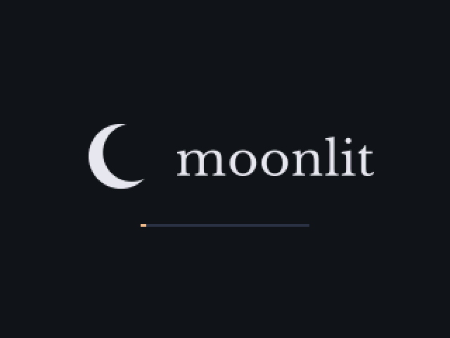

## What it is

moonlit.aura replaces the whole interface of [Rockbox](https://www.rockbox.org)
on an iPod Classic 6G with **Waning Crescent**: a quiet, dark design where light
falls from the upper left, depth comes from tone rather than blurred shadows,
and every screen is drawn for a 320×240 panel and a click wheel — no touch
metaphors, no menus you cannot reach with a thumb.

It runs on hardware with no GPU and no FPU, so everything you see is
deliberate: fonts, icons and the logo are compiled into the binary, animations
never touch the disk, and no colour exists outside a single token file.

## Install

**Install it with [Aura Studio](https://github.com/Ricolinos/Aura-Studio)** —
it walks you through DFU, the bootloader and copying your library. No terminal
commands, on macOS or Windows.

## Highlights

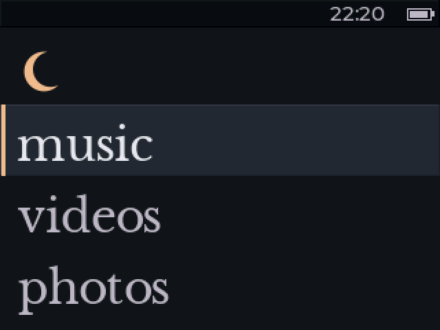

The home screen. Four destinations, one selected row, nothing else competing
for attention.

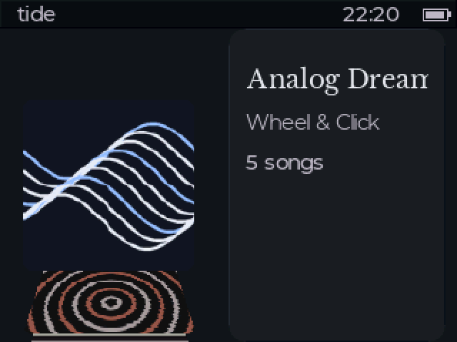

**Tide** is the album browser: a vertical cover flow that leans the covers away
from you as they scroll. Music opens straight into it.


An album with no artwork gets a monogram instead of a placeholder icon — the
initial, drawn in the album's own tile colour.

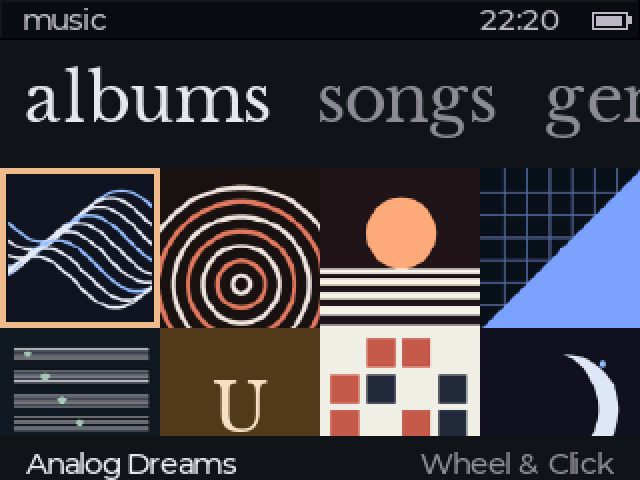

The album grid, one screen for the whole library. The selected tile keeps a
visible frame even when the artwork is bright.

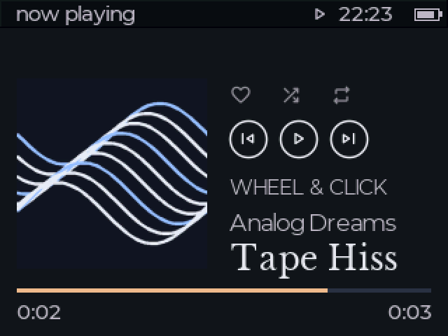

Now playing: artwork, transport, and the track title in the largest type on the
device. The background stays a flat tone — never a blurred copy of the cover.

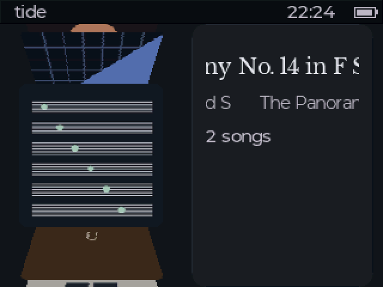

Long titles scroll. In Tide the title and the artist scroll on **separate,
offset cycles**, so the panel never pulses in unison.

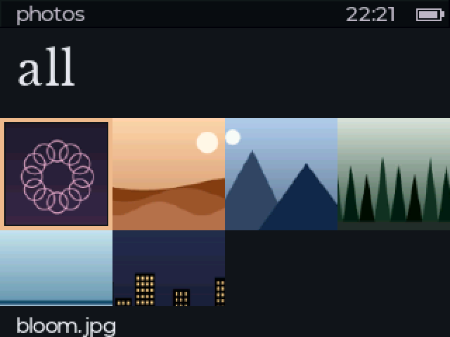

Photos, as a grid of real thumbnails derived once and shared across firmware
families.


The viewer decodes the full photo when the wheel stops. While you are still
spinning it shows an instant preview, so a fast scrub stays responsive.

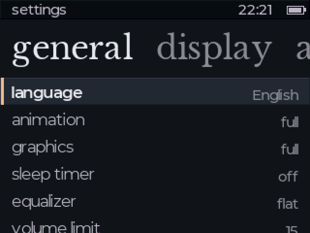

Settings, in the same list language as everything else.

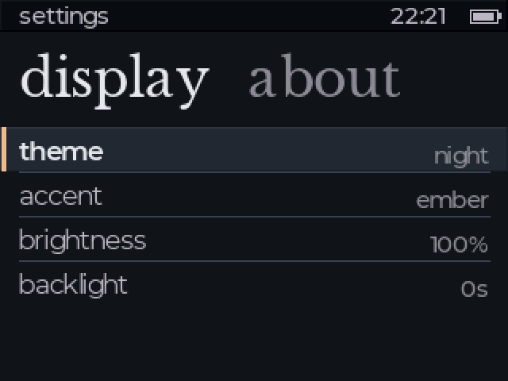

Two colour schemes, four accents, brightness and backlight.

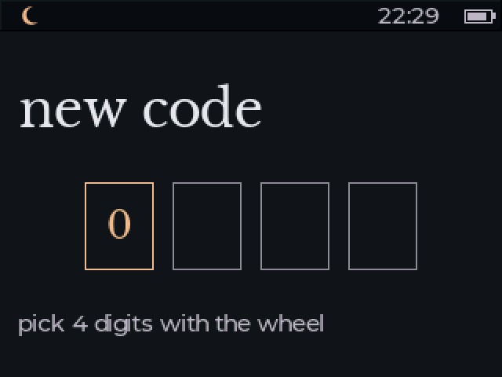

A four-digit lock, dialled with the wheel. It can also arm itself from the Hold
switch.

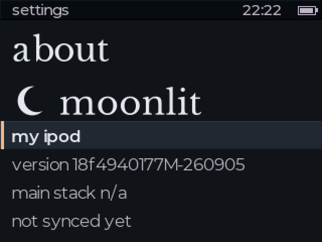

About: build version, device name, sync state.

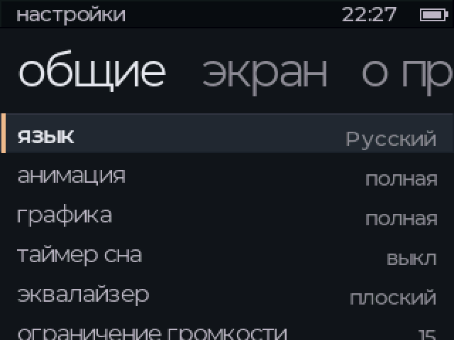

Six interface languages. Russian ships a separate Cyrillic face for all seven
type roles, so library titles in Cyrillic render properly rather than
transliterated.

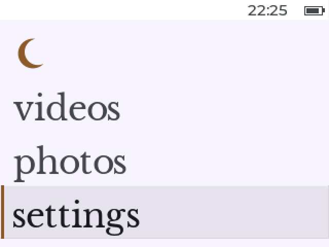

`dawn`, the light scheme — the same design with the tones inverted, not a
different skin.

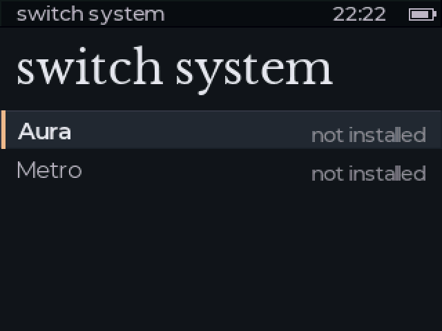

Three firmware families can live on one iPod. Switching keeps your library,
artwork cache and everyday settings.

## Features

- **Six languages**: Spanish, English, French, German, Russian and Italian —
  the whole interface, including boot-time messages.
- **Real typography**: Libre Baskerville for titles, Montserrat for text, seven
  roles, none below 18 px. Curly quotes, dashes and ellipses are drawn with a
  dedicated punctuation face instead of being flattened to ASCII.
- **Shared settings across families**: lock, brightness, sleep, backlight,
  wheel click, volume limit, language and appearance follow you when you switch
  firmware.
- **Selective updates** from Aura Studio: only the files that actually changed
  are copied.
- **Shared artwork cache**: a cover is decoded once and reused by every family
  on the device.
- **Passcode lock**, optionally armed by the Hold switch.
- **Tide**, the vertical cover flow, with directional prefetch and a strict
  per-frame budget so scrolling never waits on the disk.
- **Lyrics**, playlists, ratings, replaygain, sleep timer, equalizer presets.

## Sister firmwares

moonlit.aura is one of three families that share a device, a library and a
Studio:

- [Aura-Firmware](https://github.com/Ricolinos/Aura-Firmware) — the original.
- [Metro-Aura](https://github.com/Ricolinos/Metro-Aura) — a Zune-inspired
  interpretation, and moonlit's own upstream.

All three can be installed side by side; switch between them from
**Settings › switch system**.

## Roadmap

- **Japanese characters** (kana plus jōyō kanji) through a glyph cache rather
  than a resident font — the current per-role font approach does not scale to
  thousands of glyphs, and the RAM budget for it has to be planned before the
  work starts, not measured after.
- **More languages**, once the text pipeline handles non-alphabetic scripts.
- Hardware verification of Tide's timing on a large library.

## Building from source

```bash
firmware/tools/build_toolchain.sh   # once (or RBDEV_TOOLCHAIN=<bin/> of an existing one)
firmware/tools/build_sim.sh --run   # SDL simulator, for day-to-day work
firmware/tools/build_target.sh      # real ipod6g target + bootloader
firmware/tools/package_dist.sh      # the release artifacts
```

Details in `docs/guia-desarrollo.md` (Spanish). Screenshots in this README are
simulator captures at 320×240, scaled ×2, built from a synthetic library
generated by `firmware/tools/gen_readme_media.py` — every cover, photo and
artist name in them is original and made up.

## Decisions

`DECISIONS.md` is the project's logbook: every decision is closed there, with
its reasoning and its measurements, before the code is written. It is the place
to look when you want to know *why* something is the way it is. The inherited
Metro log is kept read-only in `DECISIONS-METRO-ARCHIVE.md`.

## License, credits and trademarks

This project is free and open source. The firmware is a fork of
[Rockbox](https://www.rockbox.org) and is released under the GNU General
Public License v2 (see `LICENSE`, `MODIFICATIONS.md` and
`THIRD-PARTY-NOTICES.txt`). Aura Studio is distributed free of charge.

Created and maintained by **Ricolinos**. Rockbox is the work of the Rockbox
community; this project is not affiliated with, endorsed by, or sponsored by
Rockbox, Apple Inc., Microsoft Corporation or moonlit.market.

iPod is a trademark of Apple Inc. Zune, Metro and Windows are trademarks of
Microsoft Corporation. The visual languages of these firmwares are original
interpretations inspired by those designs; they include no proprietary assets
(no SF Pro, SF Symbols, Segoe UI or other proprietary fonts or icons).
Fonts and icons used are licensed under the SIL Open Font License or MIT and
are credited in `THIRD-PARTY-NOTICES.txt`.

Provided "as is", without warranty of any kind. Flashing firmware to a device
is done at your own risk.
