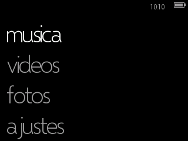
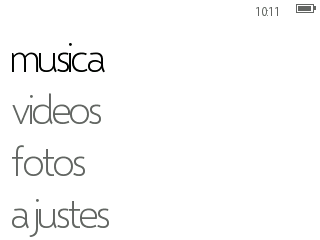
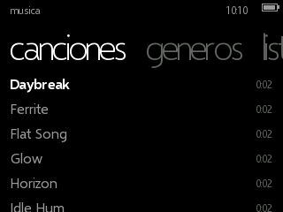
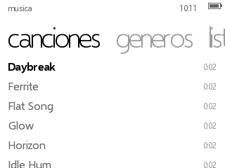
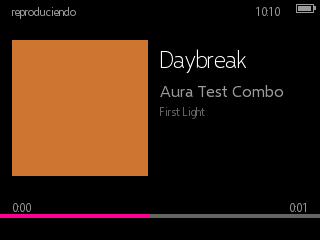
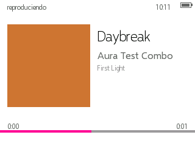

# Metro-Aura

Firmware para iPod Classic 6G (fork de [Rockbox](https://www.rockbox.org/))
que homenajea el design system Metro de Microsoft: el esqueleto de
navegación "twist" del Zune 30 (listas verticales + movimiento
horizontal entre pivots, pensado para input no táctil) con el lenguaje
visual del Zune HD (tipografía dominante, tiles, colores planos), hasta
donde el hardware del 6G lo permite (pantalla 320×240, 64 MB RAM, ARM
sin GPU, clickwheel).

Es "el Zune que Microsoft habría diseñado para el iPod".

## Qué trae (v0.3.0)

Navegación twist completa, música sobre tagcache (artistas/álbumes/
canciones/géneros/playlists) con Now Playing y carátula real, video y
fotos con miniaturas y visor propio, ajustes reales (tema, 10 acentos,
idioma ES/EN, brillo, EQ, temporizador de sueño, candado de pantalla),
y un motor de transiciones propio (twist, turnstile, fade, feather,
continuum) con tres niveles de FX.

De la ronda 3: **letras `.lrc` sincronizadas**, **fotos de artista**,
**Quickplay** (álbumes recientes), **calificaciones** importadas de
Aura Studio, **candado de 4 dígitos** y **CONTINUUM** (el título de la
fila vuela a la página nueva).

De la ronda 4, tras el primer flasheo real: **iconografía Fluent**,
**PLAY desde cualquier pantalla**, **indicador de reproducción/pausa**,
**cuadrícula de álbumes**, **fondo del reproductor separado del tile**,
y el catálogo español **con acentos de verdad**. Detalle completo en
`docs/ESTADO_FINAL.md`.

> **Verificado en el simulador SDL.** El aparato real se flasheó por
> primera vez en la ronda 4 — de ahí salieron las correcciones de esa
> ronda — pero la lista de verificación en hardware sigue sin
> responder. Está en `docs/ESTADO_FINAL.md`.

## Capturas

Simulador SDL, tema oscuro (acento magenta, el default — `DECISIONS.md`
M-020) y tema claro lado a lado. Matriz completa (2 temas × 3 acentos)
en `docs/screenshots/F10-matrix/`, generada con `firmware/tools/sim_matrix.sh`.

| | Oscuro | Claro |
|---|---|---|
| Hub |  |  |
| Lista |  |  |
| Now Playing |  |  |

## Compatibilidad con Aura Studio

Este firmware es 100% compatible con
[Aura Studio](https://github.com/Ricolinos/Aura-Studio) (la app de
escritorio que sincroniza biblioteca/fotos/videos al dispositivo):
misma estructura de directorios, tagcache, formatos y marcador de
sincronización — ver `docs/COMPAT_STUDIO.md` (checklist vivo) y
`Aura-Firmware/CONTRATO-firmware-studio.md`/`docs/contracts/library-layout-v1.md`
(fuente del contrato).

**Advertencia**: si tienes Aura Studio instalado con el firmware de
Aura embebido, el chequeo de actualización comparará hashes y puede
ofrecer "actualizar" tu iPod con Metro de vuelta a Aura — ver
`DECISIONS.md` M-004 y `docs/ESTADO_FINAL.md`.

## Compilar

Ver `docs/guia-desarrollo.md`. Resumen:

```bash
firmware/tools/build_toolchain.sh   # una sola vez, ~unos minutos
firmware/tools/build_sim.sh --run   # simulador SDL, día a día
firmware/tools/build_target.sh      # target real ipod6g + bootloader
```

## Instalar

Ver `docs/GUIA_FLASHEO.md` — procedimiento completo con `mks5lboot`,
requisitos, y qué hacer si algo sale mal.

## Estado del proyecto

`docs/ESTADO_FINAL.md` es el estado actual (v0.3.0) y la lista de
verificación en hardware pendiente. Los planes de cada ronda están en
`docs/plans/`, las desviaciones respecto a ellos en
`docs/DESVIACIONES.md`, y la fuente de verdad de las decisiones en
`DECISIONS.md`.

## Licencia

GPL v2 (heredada de Rockbox) — ver `LICENSE`. Avisos de modificación
en `MODIFICATIONS.md`.
